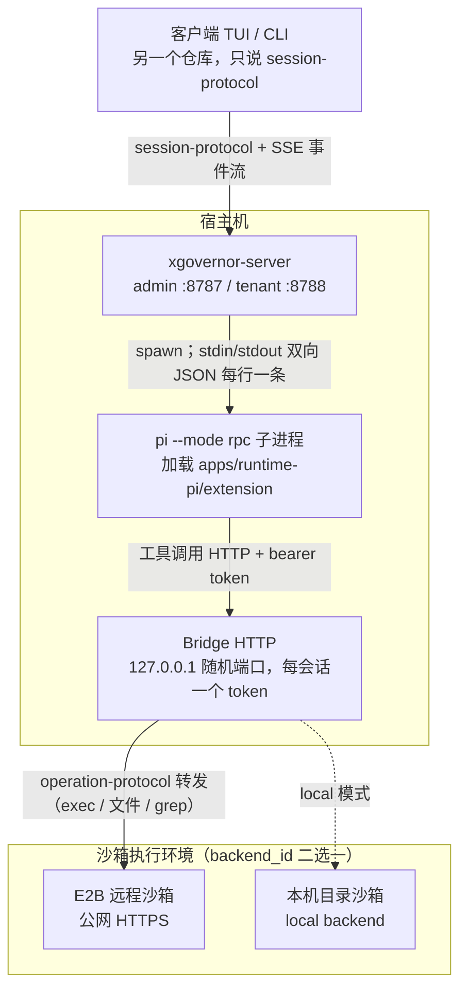

# Pi Runtime Demo

> 面向想跑通 `apps/runtime-pi`（真实 `pi --mode rpc` 而非合同测试里的 fake-pi）端到端 demo 的人。
> 本流程已在 pi 0.84.2 + DeepSeek + E2B 上端到端验证过一次（2026-08-15），实跑记录见 §10，踩过的坑见 §0 与 §11。
> 架构背景：[runtime_adapter_guide.md](./runtime_adapter_guide.md) §2、[protocol_boundaries.md](./protocol_boundaries.md) §5 point 4 —
> `apps/runtime-pi` 现在**组合** `InstanceManager`（`local`/`e2b`，按会话选），Pi 的工具执行（读写文件、exec、grep/glob）经一个
> 本地 HTTP 桥（`apps/runtime-pi/src/bridge.rs` + `apps/runtime-pi/extension/` 里的 TS Pi 扩展）转发到真正的沙箱/工作区，不再直接碰
> daemon 本机文件系统。仍然直接在 daemon 本机 `tokio::process` 拉起的，只有 `pi --mode rpc` 这条 RPC 控制通道本身——结构性原因见
> 上面两篇文档。这意味着这份 demo 也不再是"没有沙箱层"的单机写照：`ext.runtime_pi.backend_id` 现在是每个会话必填的字段（见 §3），
> 决定 Pi 的工具落到 `local` 沙箱还是 `e2b` 沙箱。

## 部署视图

一图看清各组件跑在哪、流量怎么走（模块级内部数据流见 [`pi_runtime_architecture.mermaid`](./pi_runtime_architecture.mermaid)）：



四条边就是全部流量路径：① 客户端 ↔ server 的 session-protocol（两个监听端口 + SSE 事件流）；② server 与 pi 子进程之间是
**宿主机本机**的 stdin/stdout JSON 对话（pi 进程不在沙箱里，是 daemon 的子进程）；③ pi 的扩展与 Bridge 之间是
`127.0.0.1` 本机 HTTP（每会话一个 bearer token）；④ Bridge 与沙箱之间走 operation-protocol——e2b 是公网 HTTPS 到远程沙箱，
local 则是本机目录。

## 0. 前置条件（首次跑之前必读）

三个最容易卡住的点，全部实测踩过（细节见 §10 实跑记录）：

1. **pi 需要一个 LLM 的 API key**。没有 key 时 pi 会接受 prompt，但立刻以 `No API key found for the selected model` 拒绝，
  事件流里表现为 `turn_failed`（`pi_prompt_rejected`）。实测设置 `DEEPSEEK_API_KEY` 后 pi 自动识别并选中
   `deepseek-v4-pro`（当环境里只有这一个 provider 配了 key 时）。其他 provider 见 pi 自带的 `docs/providers.md`
   （`ANTHROPIC_API_KEY`/`OPENAI_API_KEY`/`GEMINI_API_KEY`/…），pi 会根据已配 key 选 provider。
2. **daemon 进程的 HOME 必须可写**：pi 会把 session 状态写进 `~/.pi/agent/sessions`，headless 容器/服务账户下要保证这一点，
  否则 pi 启动即崩（`EPERM: mkdir ~/.pi/agent/sessions/...`），server 侧表现为
   `failed to send prompt to pi process: Broken pipe`。可以用 `HOME=/可写路径` 启动 server 规避/验证。
3. `workspace` **的字段名是** `kind` **不是** `type`：`WorkspaceSpec` 的 serde tag 后来从 `type` 改成了 `kind`
  （`crates/session-protocol/src/environment.rs`），传 `{"type": ...}` 会 400 `missing field 'kind'`。


## 1. 装 Pi

```bash
npm install -g @earendil-works/pi-coding-agent
pi --version   # 确认可执行文件在 PATH 上
```

`apps/runtime-pi` 默认会在 `PATH` 里找一个叫 `pi` 的可执行文件（`apps/runtime-pi/src/lib.rs` 里的 `DEFAULT_PI_EXECUTABLE`）。如果你的安装方式不把它放上
`PATH`，或者想用一个特定路径/版本，有两种覆盖方式，任选其一：

- 进程级：设置环境变量 `XGOVERNOR_PI_EXECUTABLE=/absolute/path/to/pi` 再启动 `xgovernor-server`。
- 单次 open 级：在 `SessionOpenRequest.ext.runtime_pi.executable` 里传路径（见下面 §3），只影响这一个会话。

还需要装一次 Pi 扩展（把 Pi 内置工具的执行转发到桥接层的那个 TS 包，见 `apps/runtime-pi/extension/README.md`/`CONTRACT.md`）的依赖：

```bash
cd apps/runtime-pi/extension
npm install
```

`apps/runtime-pi` 默认用 `concat!(env!("CARGO_MANIFEST_DIR"), "/extension")` 作为 `pi -e <extension_dir>` 的路径（即上面这个目录本身），单次 open 级
可以用 `ext.runtime_pi.extension_dir` 覆盖。**这个扩展已在真实 pi 上端到端验证过**（2026-08-15，pi 0.84.2 + DeepSeek + E2B。

## 2. 启动 xgovernor-server

`xgovernor-server` 总是同时起两个监听器（`docs/tenancy_design.md` §3.1）：一个只认 admin token 的回环地址(`XGOVERNOR_BIND_ADDR`，必须是
127.0.0.1/::1/localhost)，一个可以对外的 tenant 地址(`XGOVERNOR_TENANT_BIND_ADDR`)。两者都要有 token 才允许启动。

最小可跑起来的环境变量组合：

```bash
export XGOVERNOR_BIND_ADDR=127.0.0.1:8787            # admin 面，默认值就是这个，可省略
export XGOVERNOR_TENANT_BIND_ADDR=127.0.0.1:8788      # 必须显式设置，没有默认值
export XGOVERNOR_BEARER_TOKEN=demo-admin-token         # admin 面 token
export XGOVERNOR_TENANT_TOKENS_JSON='[{"token":"demo-tenant-token","tenant_id":"demo-tenant"}]'
export XGOVERNOR_DEFAULT_WORKSPACE_ROOT=/tmp/xgovernor-pi-demo   # 可选；不设则退化为系统临时目录
export E2B_API_KEY=e2b_...          # 本 demo 用 e2b 后端，必填；只用 local 后端可省略
export DEEPSEEK_API_KEY=sk-...      # pi 的 LLM key（见 §0.1）；换 provider 就换对应环境变量
export HOME=/tmp/xgovernor-pi-demo-home  # 保证 pi 能写 ~/.pi/agent/sessions（见 §0.2）；本机有正常 HOME 可省略
mkdir -p "$XGOVERNOR_DEFAULT_WORKSPACE_ROOT" "$HOME"

cargo run -p xgovernor-server
```

`XGOVERNOR_TENANT_TOKENS_JSON` 里每个条目的 `quota`/`rate_limit` 字段省略即视为不限（`apps/server/src/httpserver/auth.rs`）。会话数据（SQLite）默认落在
`~/.xgovernor/xgovernor.db`，可用 `XGOVERNOR_DATA_DIR` 改路径——`local`/`e2b` 两个 `InstanceManager` 的 provider-instance ledger 也共享这个文件。

`local` 这个 `backend_id` 总是可用；`e2b` 是否可用取决于启动时是否设置了 `E2B_API_KEY`——没设的话 `apps/server` 只会注册 `local`，
日志里会打一条 info 说明，服务照常启动（不是致命错误）。这份 demo 后面全用 `e2b`（已实测跑通）；离线自测把 §3 里的
`backend_id` 换成 `local` 即可。

下面的例子都打 admin 面（`127.0.0.1:8787`），用 `Authorization: Bearer demo-admin-token`。为什么不是 tenant 面：
`docs/tenancy_design.md` §5.4 的准入要求 tenant 会话必须「git 工作区 + 沙箱 provider」——`daemon_default` 会被拒
（`tenant sessions require a sandboxed provider and a git workspace source`）。demo 走 admin 面最省事；tenant 面现在
也能跑通，但必须同时满足三个条件：`workspace.kind = "git"`（仅 https 通过 URL 卫生检查）、`backend_id = "e2b"`
（`"local"` 是宿主进程，`PiSessionEnvironment` 对它声明 `provider_is_sandbox = false`，tenant 依然被拒）、且
`E2B_API_KEY` 已配置——满足时 open 的 `isolation.boundary` 报 `remote`，沙箱内会先 `git clone` 到
`/home/user/workspace` 再挂桥接层（见 §11 的「隔离事实」一条）。

## 3. 打开一个会话（`POST /api/v1/sessions/open`）

`workspace` 字段留空即用 daemon 默认（`WorkspaceSpec::DaemonDefault`，落在 `XGOVERNOR_DEFAULT_WORKSPACE_ROOT` 下）；显式传时字段名是
`kind`（serde tag，写 `type` 会 400 `missing field 'kind'`，见 §0.3）。`ext.runtime_pi` 现在是
**必填**命名空间，且 `backend_id` 字段必填（`"local"` 或已配置了 `E2B_API_KEY` 时的 `"e2b"`）——它决定 Pi 的工具执行经桥接层落到哪个
`InstanceManager` provision 出来的沙箱；缺失或未知的 `backend_id` 会被拒（`InvalidRequest`，见 `apps/runtime-pi/src/lib.rs`）。
`ext.runtime_pi.executable`/`extension_dir` 仍是可选的 per-session 覆盖，不传就用 §1 里配置的默认值。

```bash
curl -sS -X POST http://127.0.0.1:8787/api/v1/sessions/open \
  -H 'Authorization: Bearer demo-admin-token' \
  -H 'Content-Type: application/json' \
  -d '{
    "conversation_id": "demo-conversation-1",
    "sender_id": "demo-user",
    "workspace": { "kind": "daemon_default" },
    "ext": { "runtime_pi": { "backend_id": "e2b" } }
  }'
```

响应（`SessionOpenResponse`）形如：

```json
{
  "runtime_id": "<server 生成的 uuid>",
  "conversation_id": "demo-conversation-1",
  "sender_id": "demo-user",
  "status": "active",
  "created_at_ms": 1755230000000,
  "updated_at_ms": 1755230000000,
  "runtime_kind": "pi",
  "workspace": { "...": "..." },
  "isolation": { "...": "..." },
  "effective_capabilities": { "...": "..." },
  "llm": null
}
```

记下 `runtime_id`，后面每一步都要用它。

## 4. 订阅事件流（先订阅再提交 turn）

turn 的输出、工具活动、终态都走 SSE：`GET /api/v1/sessions/:runtime_id/turns/:turn_id/events`。但 `turn_id` 是提交 turn 时服务端才签发的
（`SessionSubmitReceipt.turn_id`），所以实践顺序是：提交 turn 拿到 `turn_id` → 立刻用它订阅事件流。事件流的注册表有 30s TTL
（`STREAM_ENTRY_TTL`，见 `apps/server/src/httpserver/session.rs`），别拖太久再订阅。

## 5. 提交一个 turn（`POST /api/v1/sessions/turns`）

```bash
curl -sS -X POST http://127.0.0.1:8787/api/v1/sessions/turns \
  -H 'Authorization: Bearer demo-admin-token' \
  -H 'Content-Type: application/json' \
  -d '{
    "runtime_id": "<上一步拿到的 runtime_id>",
    "text": "查看当前目录"
  }'
```

响应（`SessionSubmitReceipt`）：

```json
{ "runtime_id": "<...>", "turn_id": "<server 生成>", "accepted_kind": "turn" }
```

这一步在 `apps/runtime-pi` 内部立刻返回（不等 pi 把 turn 跑完——`runtime_adapter_guide.md` §3 point 六的合同），真正的执行在后台任务里跑，事件
经下一步的 SSE 流出来。

## 6. 拉事件流

```bash
curl -N -sS http://127.0.0.1:8787/api/v1/sessions/<runtime_id>/turns/<turn_id>/events \
  -H 'Authorization: Bearer demo-admin-token'
```

会看到一串 `event: message` 的 SSE 帧，`data` 里是归一化后的 `SessionEvent`（`output_delta`、`tool_activity`、`turn_completed`/`turn_failed`
……），直到收到终态事件（`turn_completed` 或 `turn_failed`）连接才会结束。

## 7. 如果 pi 发起了交互请求（`InteractionRequested`）

`apps/runtime-pi` 宣告了 Interaction 能力：pi 侧的 `extension_ui_request`（`select`/`confirm`/`input`/`editor` 等 dialog 方法）会被翻译成
`SessionEvent` 里的交互请求事件，带一个 `interaction_id`。收到后用 `POST /api/v1/sessions/interactions` 回应：

```bash
curl -sS -X POST http://127.0.0.1:8787/api/v1/sessions/interactions \
  -H 'Authorization: Bearer demo-admin-token' \
  -H 'Content-Type: application/json' \
  -d '{
    "runtime_id": "<runtime_id>",
    "turn_id": "<turn_id>",
    "interaction_id": "<事件里给的 interaction_id>",
    "answer": { "kind": "confirm", "value": true }
  }'
```

`answer` 是个标签联合（`SessionInteractionAnswer`，serde tag 是 `kind`）：`{"kind":"text","value":"..."}`、`{"kind":"selection","value":["a","b"]}`、
`{"kind":"confirm","value":true}`、`{"kind":"data","value":{...}}`、`{"kind":"cancelled"}` 五选一，取决于 pi 那边 dialog 的方法是什么。

## 8. 取消一个正在跑的 turn（可选）

```bash
curl -sS -X POST http://127.0.0.1:8787/api/v1/sessions/cancel \
  -H 'Authorization: Bearer demo-admin-token' \
  -H 'Content-Type: application/json' \
  -d '{ "runtime_id": "<runtime_id>" }'
```

`apps/runtime-pi` 的 `cancel` 有真实中断语义（不是"返回 Ok 但 turn 该怎么跑还怎么跑"的空操作）：调用后事件流会尽快收到
`turn_completed` / `outcome: cancelled`，而不是等 pi 自然跑完。

## 9. 收尾

```bash
curl -sS -X POST http://127.0.0.1:8787/api/v1/sessions/close \
  -H 'Authorization: Bearer demo-admin-token' \
  -H 'Content-Type: application/json' \
  -d '{ "runtime_id": "<runtime_id>" }'
```


## 10. 一次已验证的端到端实跑（2026-08-15）

环境：pi 0.84.2（homebrew 全局安装）、node v25.4.0、DeepSeek API key、E2B API key、macOS；流程即本文 §2–§9
（admin 面 + `backend_id="e2b"` + `daemon_default` 工作区 + 「查看当前目录」）。

实测事件流（SSE，节选）：

```text
tool_activity  ls     begin → end(status=failed,  "Path not found: /Users/hypo/Github/xGovernor")
tool_activity  bash   begin → end(status=succeeded, "/tmp/xgovernor-pi-demo/workspace\ntotal 0\ndrwxr-xr-x 2 user user 60 ...")
turn_completed outcome=complete
```

- `bash` 的输出来自**远程 E2B 沙箱内部**（`pwd` + `ls -la`，属主 `user user`）：pi 的工具调用经桥接层 →
`E2bOperationBackend` 在真实沙箱里执行，不是 daemon 本机。
- 第一次 `ls` 的失败就是 §11 的「ls cwd 锚定」坑：pi 用自己进程的宿主 cwd 构造了绝对路径再走桥接层，沙箱里没有这个路径；
pi 自动降级改用 `bash` 工具后 turn 正常 complete，所以整体交互仍然成功。

关闭与销毁验证（`退出关闭`）：

```bash
curl -sS -X POST http://127.0.0.1:8787/api/v1/sessions/close \
  -H 'Authorization: Bearer demo-admin-token' -H 'Content-Type: application/json' \
  -d '{ "runtime_id": "<runtime_id>" }'
# → {"runtime_id":"...","status":"closed","updated_at_ms":...}

# 等几秒后查 E2B 平台：该沙箱应已消失（close 触发了远程删除）
curl -sS https://api.e2b.dev/sandboxes -H "X-API-Key: $E2B_API_KEY"
# → []（实跑时从 1 个 running 变为空列表）
```

## 10.5 重启惰性复原实跑（2026-08-17，kill -9 硬杀 + 同 runtime_id 续问）

环境同 §10（pi 0.84.2 + DeepSeek + E2B，macOS）。流程在 §2–§9 基础上加一次 `kill -9`：

1. open（`backend_id="e2b"`）→ 记下 `runtime_id`；提交 turn「用 bash 创建
   `/home/user/workspace/marker.txt`，内容 `XGOVERNOR-E2E-MARKER-42`」→ `turn_completed`。
   此时 SQLite 行 `runtime_json` 已非 Null（含 `backend_id`/`pi_session_dir`），
   `$XGOVERNOR_DATA_DIR/pi-sessions/<runtime_id>/` 下出现会话 JSONL。
2. `kill -9 <xgovernor-server pid>`（SIGKILL，无优雅退出）——SQLite 行、会话 JSONL、远端沙箱全部存活。
3. 重启 server（同 `XGOVERNOR_DATA_DIR`）→ 启动时 `reconcile` 把账本里 active 的沙箱重新挂回
   （e2b 经 `fetch_sandbox_detail` 重新拉 access token 并校验存活）。
4. **同 `runtime_id` 直接** `POST /sessions/turns` 问「我们刚才在做什么？」→ 正常接受并
   `turn_completed`；pi 完整回忆起上一轮 marker 任务（含内容与 23 字节细节）——上下文经
   `--session <最新 jsonl>` 真实延续。E2B 平台仍是同一个 sandbox id，再问一次
   `cat marker.txt` 输出 `XGOVERNOR-E2E-MARKER-42`（沙箱文件系统连续）。
5. `POST /sessions/close` → `{"status":"closed"}`，等几秒查 E2B 平台 running 归零——沙箱真实销毁。

fail-closed 验证（§11 的「沙箱已死」分支）：外部手工 `DELETE /sandboxes/<id>` 模拟过期/回收 →
重启 server → 同 runtime_id submit_turn → `{"code":"unavailable","message":"pi_sandbox_gone: ..."}`
（reconcile 日志有 `WARN re-attach failed; treating as orphaned`），SQLite 行置 `failed` +
`last_error` 落库。不自动重建空沙箱——重建留给显式的新 open。


## 11. 已知边界（demo 场景下要知道的坑）

- ~~沙箱、配额、跨重启 reconcile 现在都在——它们由 `ext.runtime_pi.backend_id` 选中的那个 `InstanceManager` 正常提供，与
`apps/runtime-mock` 无异。仍然没有的只是 `pi` **子进程自己**的账本：daemon 进程重启后，之前 `pi` 子进程的进程内注册表随之清空——正在跑的
turn 不会在重启后自动恢复（它所附着的沙箱本身不受影响，只是没有 `pi` 进程再跟它对话了）。~~
  **已修复（2026-08-17，惰性复原，见 §10.5）**：daemon 重启后 `pi` 子进程注册表确实随进程清空，但
  会话的复原信息已随 open 持久化进 `SessionRecord.runtime`（`backend_id`/`pi_session_dir`/……），
  重启后任意请求（submit_turn / open 重附着 / answer / cancel / close）踩到「SQLite 有行、adapter
  无实例」缝隙时会惰性复原：向 `InstanceManager` 要回既有沙箱（e2b 经平台重新校验存活并重拉
  access token），`pi --mode rpc --session <最新 jsonl> --session-dir <per-runtime dir>`
  重新拉起并加载会话文件——上下文真实延续（§10.5 已实跑）。两个 fail-closed 场景按设计**不**
  静默降级：① 沙箱已死（e2b 过期/被回收）→ `pi_sandbox_gone`，行置 `failed`；② 会话文件缺失或
  末行校验不通过（`pi_session_state_lost`）——不会"看起来复原了其实失忆"。进行中的 turn 按设计
  丢弃不续跑（pi 本身按整 turn 批量落盘，SIGKILL 后磁盘精确停在上一个完整 turn）。
- 工具执行本身（读写文件、跑命令、grep）不再直接碰 daemon 本机文件系统——它们经桥接层落到 `InstanceManager` provision 出来的沙箱里，
沙箱边界与隔离级别由所选 `backend_id` 决定（`local` 沙箱仍是本机一个目录，隔离级别与之前一致；`e2b` 是真正的远程沙箱）。
- Steering（turn 进行中插话）不在范围内（架构决策，见本文件开头链接的两篇文档）——一个 turn 提交后只能等它结束或整体 `cancel`，不能中途
塞第二段文本进同一个 turn。
- 桥接层（`apps/runtime-pi/src/bridge.rs`）目前是单进程内的 HTTP 服务，绑在 `127.0.0.1:0`（随机端口），每个会话一个 bearer token，
`stop()` 时随会话一起注销；它本身没有跨重启持久化，这与"沙箱账本在 InstanceManager 里"是两回事，不冲突。
- **隔离事实标注与 e2b 不符（已修，见 §2）**：旧实现里 open 的隔离事实由 `apps/server/src/main.rs` 的
  `LocalWorkspaceEnvironment` 硬编码——无论 `ext.runtime_pi.backend_id` 选什么，`isolation.boundary` 都报 `host`、
  `provider_is_sandbox` 恒为 `false`，导致 tenant 面即使请求 e2b 也被 §5.4 拒绝。现在改由
  `apps/runtime-pi/src/lib.rs` 的 `PiSessionEnvironment` 按 backend 声明：`"local"` → `boundary=host`、
  `provider_is_sandbox=false`；`"e2b"` → `boundary=remote`、`provider_is_sandbox=true`（`network` 仍报 `none`，
  因为沙箱网络未禁，不夸大隔离；`isolation.metadata` 里带 `tool_backend_id`/`controller_boundary` 说明是
  「宿主控制进程 + 远程工具后端」的复合部署）。准入矩阵变成：tenant + git + e2b 通过（url 需过 https 卫生检查），
  tenant + git + local 拒绝，tenant + 非 git 一律拒绝。配套：e2b 的 git 会话在 `PiRuntime::start()` 里先
  `git clone` 到沙箱 `/home/user/workspace`（失败则回滚删沙箱），与 `apps/runtime-mock` 的 `clone_git_workspace`
  行为一致；e2b 的 workspace root 恒为沙箱内 `/home/user/workspace`，不再把宿主路径当远程事实。
- **~~daemon 重启后，旧会话的沙箱不会随 close 销毁~~（已修复，2026-08-17，见 §10.5）**：旧实现里
  pi 子进程注册表是进程内的，重启后对旧 `runtime_id` close 返回 `not_found`，但沙箱仍活着，只能等
  E2B 过期或手工删。现在 close 对 adapter 未挂回的会话走「按持久化状态直接清理」：`stop_instance`
  注册表 miss 时回落到按账本行 `lifecycle.delete`（`InstanceManager::destroy_by_runtime_id`），
  沙箱真实销毁、会话目录删除、行置 `closed`——不再泄漏。实跑确认 close 后 E2B 平台 running 归零。


