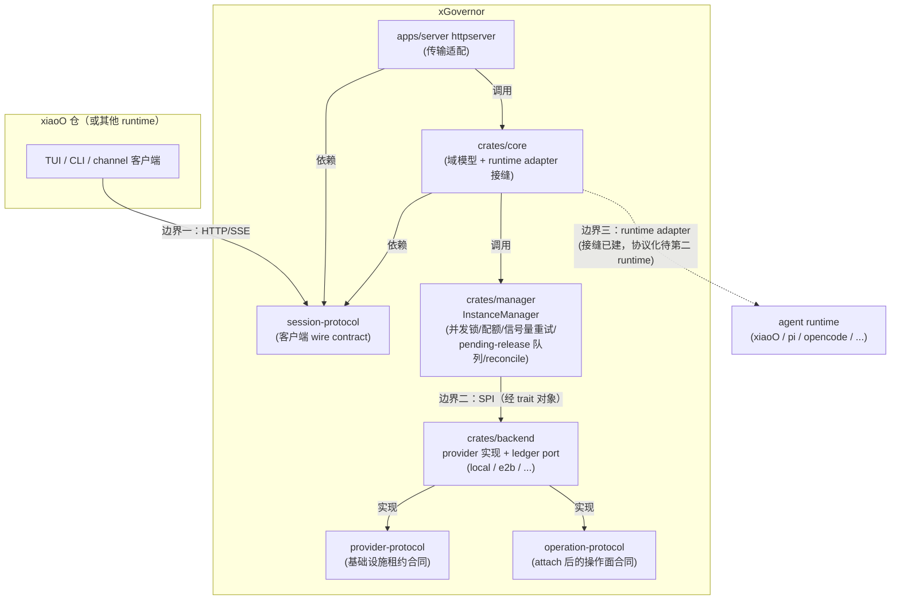

# 协议边界规范（目标态）

> 性质：normative。本文描述协议层的目标状态，作为重构的设计基准与验收标准。
> 范围：`provider-protocol`、`session-protocol` 两个协议 crate；进程内操作面合同 `operation-protocol`；作为承接层的域模型层（`crates/core`）；以及异构 agent runtime 的第三边界。

---

## 0. 协议成立的判据

一个类型是否属于协议 crate、属于协议的哪一层，看三条硬判据：

1. **双边生产消费判据**：协议是两方共同引用的约定——一方序列化、另一方反序列化（或一方调用、另一方实现）。任何声明在协议 crate 里存在，当且仅当它的两个对端都真实使用它。只有单边使用者的声明是文档，不是协议。
2. **Schema 可推导判据**：从协议 crate 的公共 API 能机械推导出完整的对外接口面——全部请求、全部响应、全部错误、全部流式事件。反向同样成立：线上传输的每一个字节的形态，都能在协议 crate 里找到唯一的声明出处。
3. **双运行时判据（虚构评审员）**：session-protocol 的**核心词汇**必须对至少两个 agent runtime 有意义。评审任何核心字段时，假想第二个 runtime（以 pi 的 JSONL RPC 与 opencode 的 HTTP/SSE 会话模型为参照原型）坐在对面："这个字段对它意味着什么？"答不上来的，不进核心——进扩展命名空间（§3.4）。**即使当前只有一个 runtime，此判据仍然生效**；它的作用正是在第二个 runtime 真实到来之前，阻止核心词汇被单一 runtime 的形状铸死。

推论：**协议 crate 的公共 API 就是合同本身**。修改协议 crate 的任何公共类型等于修改 wire format，须按 §6 的演进规则审查。

---

## 1. 分层、三条边界与依赖方向

系统有**三条边界**，当前协议化其中两条：

- **边界一**（客户端 ↔ daemon）：session-protocol。
- **边界二**（manager ↔ provider 实现）：provider-protocol 管生命周期；实例 attach 之后的操作面（exec / 文件系统 / 权限）由 **operation-protocol** 作为进程内 SPI 合同承接——它是 provider-protocol 的对应物，不是 wire 协议。这条边界的调用方不再是 `crates/core` 直接持有 provider 实现，而是 `crates/manager` 的 `InstanceManager`（见 §2.3、§4）：它持有 `Arc<dyn ProviderLifecycle>` / `Arc<dyn OperationAttach>` trait 对象，`crates/backend` 里的 `local`/`e2b` 实现二者。
- **边界三**（daemon ↔ agent runtime）：暂不建协议 crate（理由见 §7），但边界必须在域模型层显形为 **runtime adapter 接缝**（§5），且 session-protocol 的核心词汇按 §0-3 保持 runtime 中立。第三个协议未来是"沿着已有的缝抽出"，不是"重新切开"。

四条不变式：

- **依赖方向单向**：实现依赖协议，协议永不依赖实现。各协议 crate 互不依赖、互不知晓。
- **一个协议服务一对对端**：类型先问属于哪一对；哪对都不属于的，归域模型层。
- **词汇隔离**：provider-protocol 零 session 词汇；session-protocol 零 provider/沙箱实现词汇。跨层翻译只发生在域模型层的 manager/adapter 中。
- **runtime 中立**：session-protocol 的核心词汇零 runtime 专有语义。任何单一 runtime 的专有概念（xiaoO 的 skills、斜杠命令，pi 的 extension UI，opencode 的 share……）只能经扩展命名空间（§3.4）出现，对协议核心是 opaque 的。

每个协议只维护一套词汇。session-protocol 统一以 `Session*` 命名，provider-protocol 统一以 `Provider*` 命名，不存在同义别名。

---

## 2. provider-protocol：基础设施租约合同

### 2.1 定位

BackendManager（唯一调用方）与各 provider 实现（local、e2b，未来的 firecracker、k8s 等）之间的**控制面合同**：如何创建、装载、暂停、删除、查询一个隔离执行环境实例。

它回答"一个沙箱实例的生命周期长什么样"，**不**回答"谁、为了哪个会话、在里面跑什么"。上层业务身份对它是不透明的——这层中性同时也是异构 runtime 的保险：正因为它不知道 session 是什么，它更不需要知道 runtime 是什么。agent runtime 作为沙箱内的进程存在，对 provider-protocol 完全不可见。

### 2.2 协议范畴

| 模块 | 内容 |
|---|---|
| identity | `ProviderKind`、`BackendId`、`ProviderInstanceId`、`ProviderSnapshotId` |
| request | Create / Load / Pause / Delete / Inspect 五个请求 DTO；`ProviderLoadSource`（快照 / 实例 / 序列化句柄）、`ProviderPauseMode` |
| instance / outcome | `ProviderInstance`、`ProviderSnapshot`、`ProviderInstanceStatus`、`ProviderDeleteOutcome` |
| state / event | `ProviderLifecycleState`、`ProviderLifecycleEvent`、纯转换状态机（见 2.4） |
| error | `ProviderControlError` |
| capability / resource / endpoint | 实例能力宣告、资源限额与分配、端点描述 |
| provider (SPI) | `Provider` + `ProviderLifecycle` trait：所有 provider 的唯一接入点 |

**业主标识**：请求 DTO 中不出现 `session_id` / `conversation_id` 等业务身份，代之以 opaque 的 `owner_ref: String` 与 `correlation: Value`。谁是 owner、owner 内部结构如何，由调用方（manager）定义，协议不解释。

**生命周期原因**：`ProviderLifecycleReason` 使用中性词汇——`Acquire`、`Restore`、`Reclaim`、`Release`、`Shutdown`、`Reconcile`、`ErrorCleanup`、`UserRequested`。"会话打开了""会话空闲了"这类 session 语义由 manager 翻译成中性 reason 后再进入协议。

### 2.3 明确不拥有

- **操作面**：exec、filesystem、search、export。实例 attach 之后的操作面形状由独立的 `operation-protocol` crate 定义（进程内 SPI 合同）；provider-protocol 只以能力旗标（`ProviderOperationCapabilities`）宣告其存在。
- **具体 provider 的实现细节**：任何沙箱路径常量、bootstrap 清单、镜像/模板配置，归各 provider 实现层私有。
- **manager 逻辑**：并发控制、实例缓存、租约表、eviction 策略、跨实例编排。这些逻辑现在是真实代码，落在 `crates/manager`（`xgovernor_manager::InstanceManager`）——见 §4 的具体清单，provider-protocol 本身仍不知道、也不依赖它。
- **runtime 语义**：沙箱内跑什么 agent、agent 进程如何启动与对话，归 runtime adapter（§5）。

### 2.4 状态机：规格在协议，强制在 manager

生命周期状态机是无 IO、无依赖的纯转换函数（当前状态 × 事件 → 新状态 | 拒绝），属于协议规格本身——类比 TCP 状态机属于 TCP 规范。它留在协议 crate，作为合法转换关系的可执行表述，供所有 provider 实现与 manager 共同引用。

强制点唯一且在 manager：域模型层中所有实例状态变更必须经状态机的 begin / complete_success / complete_failure 转换，不存在绕过状态机直接赋值状态的代码路径。

**现状（诚实记录，非目标态）**：`crates/manager` 落地后，manager 组件本身第一次成为真实代码（§4），但它尚未接入这条状态机——`InstanceManager` 的 create/delete 路径直接调用 `ProviderLifecycle::create`/`delete` 并按调用结果 `Ok`/`Err` 分支，不经过 `ProviderLifecycleState` 的 begin/complete_success/complete_failure 转换。这个缺口在 manager 组件不存在时无从谈起是否"强制"；manager 组件存在之后，它就是一个明确、可修的技术欠账，而不是本节描述的目标态已经达成。

### 2.5 SPI 唯一性

所有 provider（含 local 与远程沙箱）通过同一个 `Provider` / `ProviderLifecycle` SPI 接入，不存在按 kind 分叉的专用构造路径。provider 之间的差异表达在 `provider_options`（opaque `Value`，由各实现自行解释）与 `ProviderCapabilities` 宣告中，不表达在调用路径的分叉上。

---

## 3. session-protocol：客户端 wire contract

### 3.1 定位

客户端（TUI / CLI / channel 接入，跨仓消费）与 xGovernor daemon 之间经 **HTTP + SSE** 传输的全部合同。这是唯一的跨仓协议依赖，公共 API 稳定性等级最高。

它承诺的产品语义是：**客户端面对任何 agent runtime，看到同一套会话 API**。runtime 之间的差异表达为能力差异（§3.5）与扩展内容差异（§3.4），不表达为 API 形状差异。

### 3.2 归属判据（两步）

1. **成员判据**：客户端通过 HTTP/SSE 与 daemon 对话时，需要这个类型吗？不需要 → 不属于本 crate，无论它多么"纯声明"。
2. **层级判据（双运行时测试，§0-3）**：需要的话，它对第二个 runtime 也有意义吗？有 → 核心词汇；没有 → 扩展命名空间（§3.4）。

### 3.3 协议范畴：五个面

**（一）会话控制面** — 会话的存在性与占用。

| 方向 | 内容 |
|---|---|
| 请求 | `SessionOpenRequest`、`SessionCloseRequest`、`SessionCancelRequest`、`SessionDetachRequest`、`SessionHeartbeatRequest`、`SessionForkRequest`；lease 字段（client_id / client_pid / client_hostname）随控制请求携带。fork 为能力门控操作（§3.5） |
| 响应 | `SessionOpenResponse`：会话的 wire 投影——runtime_id、conversation_id、sender_id、`SessionLifecycleStatus`、时间戳、**`runtime_kind`（本会话由哪类 agent runtime 驱动）**、`WorkspaceState`、`IsolationState`、**生效能力集（沙箱能力 + runtime 能力，§3.5）**、`ResolvedLlmDescriptor`（仅当 runtime 宣告 ModelOverride 能力时出现）。这是 open / resume / fork 的统一返回形态 |

**（二）会话交互面** — 把输入送进会话、把过程流出来。核心词汇是 runtime 无关的原语，准入以双运行时测试为门：

| 原语 | wire 形态 |
|---|---|
| 文本输入 | `SessionTurnRequest`：text、entry 上下文、`LlmOverrideRequest`（能力门控）、reasoning effort（能力门控）、`ext` 扩展袋（§3.4） |
| 增量输出 | SSE 事件：输出 delta（含流 id / 序号） |
| 工具活动 | SSE 事件：工具活动 begin / end（归一化的名称、状态、摘要） |
| 交互请求/应答 | SSE 事件：runtime 发起的交互请求；`SessionInteractionRequest` 回传应答 |
| 终态 | SSE 事件：turn 终态——`TurnCompleted`（outcome：complete / max_turns / budget_exhausted / cancelled + usage 统计）或 `TurnFailed`（结构化错误 + usage）；`SessionSubmitReceipt` 作提交回执，**携带服务端签发的 turn_id**，与事件流共享相关性 |

SSE 事件词汇之外的 runtime 专有事件，以带命名空间标签的**扩展事件**原样透传（§3.4）。归一化词汇的语义切分对齐业界已收敛的 agent 客户端协议（ACP 一系）的会话/事件模型，不自创方言——这使已支持此类协议的 runtime 适配成本趋近于零。

**（三）会话操作面** — 客户端对会话环境的直接操作。

| 方向 | 内容 |
|---|---|
| 请求/响应 | exec（命令、cwd、env、超时 → stdout/stderr/exit）；文件读写（路径 → base64 内容）；checkpoint / checkout / pause / resume / 快照删除的请求与结果对 |

操作面的目标是**沙箱**而非 agent，天然 runtime 无关。唯一例外是 checkpoint 语义分级：完整检查点 = 沙箱快照 + runtime 状态导出，仅当 runtime 宣告 StateExport 能力时可用；否则降级为 workspace-only。结果 DTO 必须携带 `checkpoint_scope`（full / workspace_only）声明实际达成的等级，不允许静默降级。

**（四）环境声明面** — 会话运行环境的意图与事实。核心设计是**意图与事实分离**：

| 类别 | 内容 | 出现位置 |
|---|---|---|
| 客户端意图 | `WorkspaceSpec`（daemon 默认 / 本地路径 / git / 共享）、`DeploymentProfile`、requested capabilities | 只出现在请求 |
| 服务端事实 | `WorkspaceState`、`IsolationState`（边界、访问模式、网络隔离、生效沙箱能力）、生效 runtime 能力、`SessionLifecycleStatus` | 只出现在响应；请求 DTO 在类型上无法携带它们 |

请求永远无法把"我要什么"表述成"我已被授予什么"——这条安全属性由类型结构保证，不依赖校验代码。

**（五）错误面** — `SessionWireError`：HTTP 错误响应的唯一词汇表。传输层的职责仅限于 `域错误 → SessionWireError → (status, body)` 的单一映射；不存在协议之外手工拼装的错误形态。错误面含 `UnsupportedCapability`，作为能力门控操作被拒时的统一形态。

### 3.4 扩展命名空间：runtime 专有语义的唯一通道

核心词汇之外，交互面的请求与事件各携带一个扩展袋：

- 形态：`ext: BTreeMap<String, Value>`，键为命名空间（约定为 runtime kind，如 `xiaoo`、`pi`、`opencode`，或跨 runtime 的特性域名）。
- 协议核心视其为 opaque：不解释、不校验内容、原样传递；`deny_unknown_fields` 的从严约束不进入 ext 内部。
- 内容的类型化声明归各 runtime 自己的 crate/仓库所有，由对应 runtime adapter 编解码。
- 扩展事件同理：SSE 上以命名空间标签包裹的 opaque 载荷透传，客户端按 runtime_kind 决定是否解释。

这个机制的作用：**runtime 的表达力上限不受协议核心限制，而协议核心的稳定性不受任何 runtime 演化的牵连**。

### 3.5 能力宣告与优雅降级

能力分两族，同构于两条内部边界：

| 族 | 示例 | 宣告方 | 出现位置 |
|---|---|---|---|
| 沙箱能力 | Exec、FileRead、FileWrite、Pause、Snapshot、Network | provider | `IsolationState.effective_capabilities` |
| runtime 能力 | Interaction、Steering、Fork、StateExport、ModelOverride、ReasoningControl | runtime adapter | `SessionOpenResponse` 生效能力集 |

规则：

1. 能力门控的请求字段/操作（模型覆写、reasoning effort、fork、完整 checkpoint、交互应答）在对应能力缺席时，服务端以 `UnsupportedCapability` 拒绝，客户端按能力集预先降级渲染。
2. 该机制是扩展性的核心保险：**接入新 runtime 不是协议变更，而是一组能力宣告 + 一个 adapter**。能力缺席表达"这个 runtime 不支持"，而非"协议要改"。
3. 新增能力枚举值是非破坏演进（请求侧对未知能力从严拒绝，响应侧按缺席处理）。

### 3.6 LLM 配置的双型设计

- `LlmOverrideRequest`：wire 入参，可携带明文 api_key，生命周期止于请求处理，永不持久化。整体为能力门控字段（ModelOverride）。
- `ResolvedLlmDescriptor`：解析后的描述（provider、model、api_base、key 来源标识），**类型上没有 api_key 字段**，用于持久化记录与响应；仅对宣告 ModelOverride 的 runtime 出现——governor 不对自管模型配置的 runtime 做越权承诺。

"密钥不落盘、不回显"由类型系统保证，而非由调用方自觉清洗。

### 3.7 明确不拥有

- **服务端内部命令模型**：supervisor/actor 的输入枚举、内部队列消息——客户端从不构造它们。
- **应用内部执行结果**：携带内部富类型的 turn 结果。客户端看到的是 SSE 事件与回执，不是内部结果结构。
- **持久化记录**：会话记录、运行时快照等域模型。它们可自由演化；出网必经 §3.3（一）的 wire 投影。
- **provider / 沙箱实现细节**：bootstrap 声明、远程路径常量、镜像配置。
- **任何 runtime 的类型化专有语义**：一律走 §3.4 扩展命名空间，包括 xiaoO 的——xiaoO 在协议眼中与 pi、opencode 地位平等，不因同生态而享受核心字段特权。

### 3.8 依赖约束

依赖闭包 = `serde` + `serde_json` + `thiserror`（+ std）。**不依赖任何域 crate 或 runtime crate**——wire 上需要的少数共享词汇由 session-protocol 自行声明，域类型与 wire 类型之间由域模型层的 adapter 转换。

理由：协议 crate 的传递依赖也是合同的一部分。若协议依赖一个内部富类型 crate，则那个 crate 的每次改动都是一次未经审查的 wire 变更；若协议依赖某个 runtime 的类型，则 runtime 中立不变式从根上失效。

该依赖纪律由 CI 强制：解析 cargo metadata 的依赖策略测试断言依赖闭包；边界词汇测试断言实现词汇不泄入协议源码。

---

## 4. 域模型层（crates/core）：承接边界

不是协议，但其边界由本规范一并钉死——协议之外的一切声明与行为都落在这里：

| 职责 | 说明 |
|---|---|
| 会话域模型 | 会话记录、workspace/lease/checkpoint 谱系等持久化结构；**永不直接上线**，出网必经 wire 投影 |
| runtime 状态检疫 | 会话记录中**不出现任何具体 runtime 的类型化状态**，只持有 `runtime_kind` + 版本化的 opaque `runtime_state: Value`，由对应 adapter 编解码。**坑位的实际用法（2026-08-17 落地，见 [pi_session_restore_plan.md](./pi_session_restore_plan.md)）**：`apps/runtime-pi` 把 daemon 重启后重新拉起会话所需的一切（`backend_id`、per-session 状态目录、可执行文件/扩展覆盖、workspace 元数据）编进 blob，`open` 成功后经 `export_state` 自动写入；重启后「SQLite 有行、adapter 无实例」时 application 层经 `ensure_runtime_attached` 用 `start(state=Some(blob))` 惰性复原——opaque 检疫使这成为 runtime 私有机制，core 只经手 blob，与 §4 的检疫规则一致 |
| wire ↔ 域投影 | 域记录 → `SessionOpenResponse`；域错误 → `SessionWireError`；runtime 事件 → 归一化 SSE 事件。全部投影集中于 adapter，传输层只做编解码与路由 |
| 环境归一化 | open 入口统一执行 workspace / deployment / capability 的归一化与校验，产出环境声明面的"服务端事实" |
| 会话治理 | 单写者租约表（心跳、过期、daemon 内部 principal）、孤儿回收器 |
| provider 编排 | `crates/manager`（`xgovernor_manager::InstanceManager`，独立 crate，非 `crates/core` 内部模块）：per-`runtime_id` 幂等锁、attach 失败补偿删除、delete 失败 pending-release 重试队列（`spawn_retry_loop`）、全局（非仅 per-owner）沙箱总数上限、创建路径信号量准入 + 对 retryable 错误的退避重试、`reconcile()`（启动时对账账本与 provider 实况、rehydrate 配额计数）。session 语义 → provider 中性词汇的翻译（§2.2）仍在这一层完成。**状态机强制点（§2.4）尚未接入**——`InstanceManager` 不路由 `ProviderLifecycleState` 的 begin/complete_success/complete_failure 转换，这是已知、留痕的欠账，不是本表暗示的已完成目标态。 |

---

## 5. runtime adapter：边界三的接缝规范

每个 agent runtime 经且仅经一个 adapter 接入 governor。adapter 是未来 runtime-protocol 的抽取坯子，因此其形状按"抽出即成协议"的标准约束：

1. **统一门面**：所有 adapter 实现同一个内部 trait——起停/附着 runtime 进程、提交 turn 输入、回传交互应答、取消、订阅事件流、（可选）导出/装载 runtime 状态、宣告 runtime 能力（§3.5）。
2. **翻译职责**：adapter 把 runtime 原生协议（进程内调用、pi 的 JSONL RPC、opencode 的 HTTP/SSE）翻译为归一化事件词汇（§3.3-二）；翻译不了的 runtime 专有事件，包上命名空间标签走扩展通道，不得丢弃也不得混进核心词汇。
3. **状态所有权**：runtime 内部状态的 serde 形态归 adapter 私有并自带版本号；governor 只经手 opaque blob（§4）。
4. **物理路径**：runtime 进程运行在 provider 提供的沙箱内；adapter 经由沙箱操作面（operation-protocol：exec / 端口 / 文件）到达它。adapter 依赖 provider/operation 合同，不反向可见。
   **已记录的例外（`apps/runtime-pi`，收窄版）**：`apps/runtime-pi` 组合 `InstanceManager`（每个 `backend_id` 一个，`local`/`e2b`），Pi 的工具*执行*（文件读写/编辑、exec、grep/glob）经一个本地 HTTP 桥（`apps/runtime-pi/src/bridge.rs`）转发到 `start_instance` 拿到的真实 `Arc<dyn OperationBackend>`——这一部分与本条规则完全一致，不再是例外。唯一仍然偏离的是 RPC **控制通道**本身：`pi --mode rpc` 这个子进程由 adapter 用 `tokio::process` 直接在 daemon 本机 spawn，其 stdin/stdout 上长生命周期、持续双向对话的 JSON-per-line 对话不经 operation-protocol——`OperationExec` 是一次性、全缓冲的单请求-响应合同，结构上无法承接这种交互式 stdio 会话。这条收窄后的例外的连带后果只剩：`pi` 子进程本身（不含它附着的沙箱）没有 ledger、没有跨重启 reconcile——子进程注册表与 daemon 进程同生共死；它所附着的沙箱仍由对应 `InstanceManager` 正常记账、reconcile、配额强制。**跨重启的会话恢复由此补上**（2026-08-17 惰性复原，详见 `apps/runtime-pi/src/lib.rs` 模块文档与 [runtime_adapter_guide.md](./runtime_adapter_guide.md) §3（七））：复原所需信息持久化在 §4 的状态检疫坑位（`SessionRecord.runtime`），重启后请求踩到缝隙时经 `ensure_runtime_attached` 重放 `start(state=Some(..))` 重建 `pi` 子进程并挂回原会话文件，沙箱经 `reconcile` 重新附着（e2b 重新校验存活并重拉 access token）。这不改变第 5 条对称禁令——governor 编排代码仍只认 adapter trait；也不构成对本节其余四条规则的普遍豁免，只是"物理路径"这一条在 Pi 这个具体 runtime 形状下、且仅限其控制通道的必然结果。下一个 runtime 接入时，默认仍应走沙箱+operation-protocol 路径（工具执行侧完全比照 `apps/runtime-pi` 现在的桥接模式），只有当目标 runtime 也需要一条长连接交互式控制通道时，才需要重新评估是否需要类似的窄口子例外。
5. **对称禁令**：governor 的编排代码只认 adapter trait，不认任何具体 runtime——与 §2.5 的 provider SPI 唯一性对称，不存在按 runtime kind 分叉的调用路径。

第一个真实 adapter（xiaoO）**不享有特殊地位**：其类型止步于 adapter crate 内部，是 §3.4、§4 两条检疫规则的直接受检对象。

---

## 6. 演进规则

1. **加字段**：新字段一律 `#[serde(default)]`；对外入口的请求 DTO 使用 `deny_unknown_fields` 从严（ext 袋内部除外）。
2. **删字段 / 改语义**：breaking wire change，须在消费方同步窗口内完成。
3. **新类型准入**：进协议 crate 前过 §0 判据 + 对应归属判据（§2.1 / §3.2）。"先放这儿以后再说"不是合法理由。
4. **核心字段准入需留痕**：向交互面核心新增字段的 PR/评审记录中，必须写明该字段对第二个 runtime 的意义（双运行时测试的书面化）。写不出来的，进 ext。
5. **能力枚举**：新增能力值为非破坏演进；删除或改语义为 breaking。
6. **Schema 快照**：协议 crate 配序列化形态回归测试，公共 API 变更必然导致快照 diff，使 wire 变更在 review 中显式可见。
7. **版本化时机**：跨仓消费开始前，`default` + 兼容窗口够用，不提前引入版本协商；跨仓消费开始的里程碑上再评估版本标注。

## 7. 刻意不做的拆分

为避免过度工程，以下拆分明确**不做**：

- **runtime-protocol crate 暂不建立**：只有一个 runtime 时建第三协议是过度工程。代替方案是 §5 的 adapter 接缝 + §0-3 双运行时判据，保证第二个 runtime 落地时，协议化是"沿缝抽出 adapter trait 与事件词汇"的机械动作，而非重构。抽取触发条件：第二个 runtime adapter 真实落地之时。
- session 再分 wire / domain 两个 crate——domain 留在 crates/core 即可；
- per-provider 协议 crate——差异走 `provider_options` 与能力宣告；
- per-runtime 协议或字段特化——差异走能力宣告与 ext 命名空间；
- 独立的 error crate；
- 提前的协议版本协商机制。

判断"拆够了"的信号就是 §0 判据同时成立——之后再拆只是仪式。
